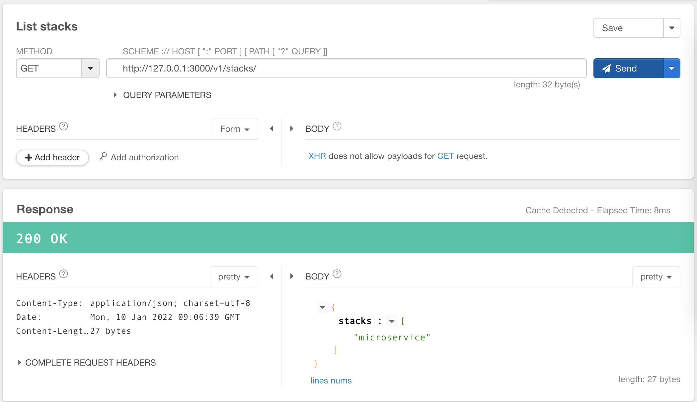
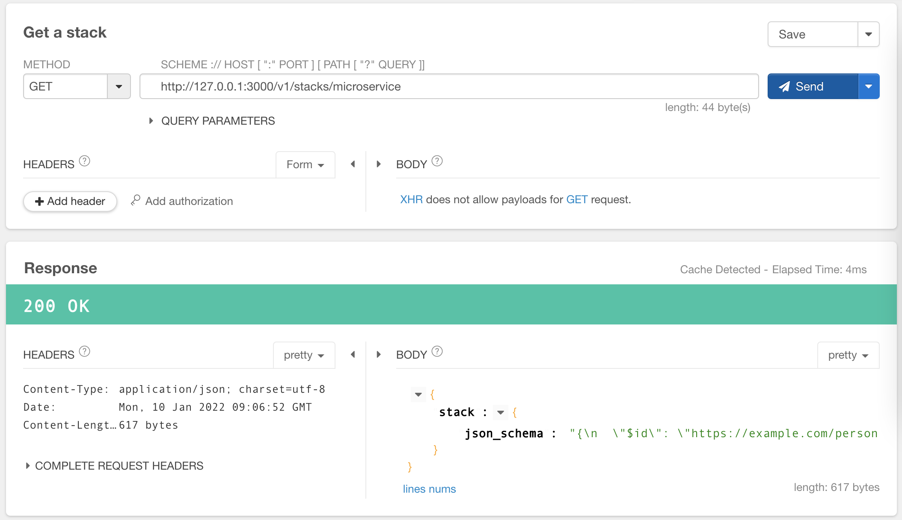
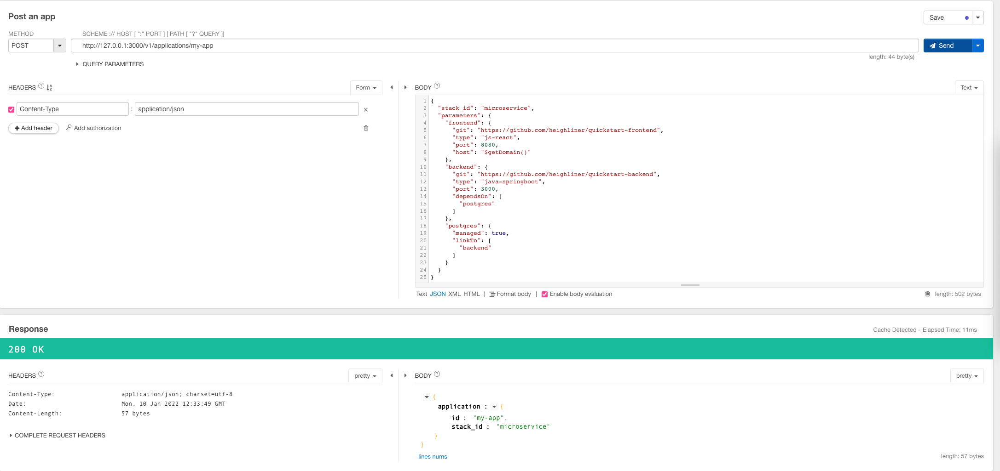

# Stack

## 什么是 Stack?

Stack 是一套预先定义好怎么部署应用的解决方案。
Stack 通过抽象底层细节来打造面向开发者的最佳实践。

Stack 包括:

- 透出给用户侧的 JSON Schema，用户侧读取后可以渲染成 UI Form 来管理应用配置。
- 后端运行的实例化控制器。当用户把配置值输入后，
  对应的 Stack 控制器就会实例化一个 Application，
  生成对应的 Infra 资源，操作部署流程等。

## 怎么用 Stack?

一个用户交互流程如下：

- 用户选择一个 Stack。
- UI 会渲染相应的 Form。
- 用户填好配置后，提交
- 后端实例化一个 Application，返回该 Application 配置，
  并在后端异步操作该应用的部署流程。

## Example 1: Deploy a microservice app

  
列举并挑选 Stack

List stacks:

Select a stack and see details:

创建一个应用，填好相应的 Stack 和配置:

TODO: 我们可以看到创建的结果:

- Infra 资源被创建
- 状态信息被返回

